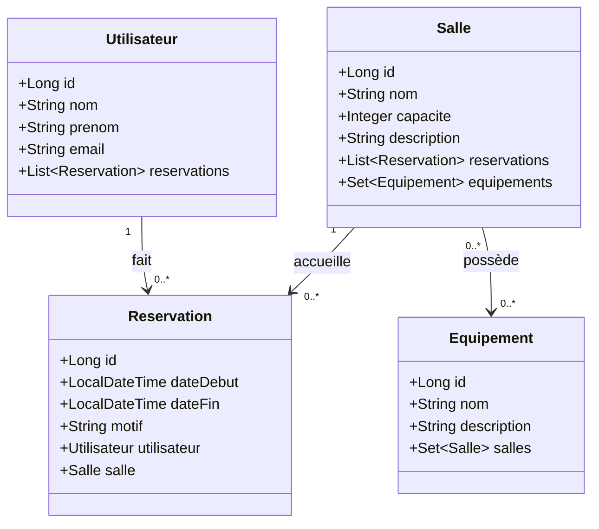

Student Hibernate Practice Project
=======
# 🏢 Gestion des Réservations de Salles — JPA / Hibernate

> A hands-on Java project demonstrating JPA & Hibernate relationships through a room reservation management system.

---

## 📽️ Demo


https://github.com/user-attachments/assets/ed38dfaa-e2d8-4dde-b596-ebc98a21d50e


---

## 📖 About The Project

This project was built as a practical exercise to explore **JPA and Hibernate ORM** concepts through a real-world use case: managing room reservations in a building or campus.

It covers all major relationship types (`@OneToMany`, `@ManyToOne`, `@ManyToMany`), cascade behaviors, orphan removal, and bidirectional synchronization — all in a clean, minimal Maven project with an in-memory H2 database.

---

## 🗂️ Entity Model

```
Utilisateur ──< Reservation >── Salle
                                  │
                            >─────┤
                           Equipement (ManyToMany)
```

| Entity | Description |
|---|---|
| `Utilisateur` | A user who can make reservations |
| `Salle` | A room that can be reserved and has equipment |
| `Reservation` | Links a user to a room for a time period |
| `Equipement` | Equipment that can be assigned to multiple rooms |

### Entity Relationship Diagram



---

## 🔗 JPA Relationships Covered

### `@OneToMany` / `@ManyToOne` — Utilisateur & Reservation
- `Utilisateur` → `Reservation` : one user can have many reservations
- `Reservation` holds the FK (`utilisateur_id`) — it's the **owner**
- `orphanRemoval = true` on `Utilisateur`: removing a reservation from the list deletes it from the DB

### `@OneToMany` / `@ManyToOne` — Salle & Reservation
- `Salle` → `Reservation` : one room can have many reservations
- `Reservation` holds the FK (`salle_id`) — it's the **owner**
- `CascadeType.ALL` on `Salle`: operations on a room cascade to its reservations

### `@ManyToMany` — Salle & Equipement
- A room can have multiple pieces of equipment, and equipment can be in multiple rooms
- `Salle` is the **owner** — it has `@JoinTable(name = "salle_equipement")`
- `Equipement` has `mappedBy = "equipements"` — it's the **inverse**
- Cascade: `PERSIST` + `MERGE` only (no `REMOVE` — deleting a room won't delete the equipment)

---

## ✅ Test Scenarios (`App.java`)

The `main` method runs three automated test scenarios:

**1. `testRelationsEtCascade`**
Creates a `Utilisateur`, a `Salle`, and a `Reservation`, links them using helper methods, and verifies that cascade persist works correctly.

**2. `testSuppressionOrpheline`**
Creates a user with two reservations, removes one from the collection, and verifies that `orphanRemoval = true` automatically deletes it from the database.

**3. `testRelationManyToMany`**
Creates rooms and equipment, links them via `addEquipement()`, then removes a link and verifies the equipment entity itself is **not** deleted (no cascade remove on ManyToMany).

---

## 🛠️ Tech Stack

| Technology | Version |
|---|---|
| Java | 11+ |
| JPA | 2.2 |
| Hibernate | 5.x |
| H2 Database | In-memory (`mem:testdb`) |
| Bean Validation | javax.validation |
| Maven | 3.x |

---

## 🚀 Getting Started

### Prerequisites

- Java 11 or higher
- Maven 3.x

### Run the project

```bash
# Clone the repository
git clone https://github.com/your-username/gestion-reservations.git
cd gestion-reservations

# Build and run
mvn compile exec:java -Dexec.mainClass="com.example.App"
```

The H2 database is **in-memory** — no setup needed. Tables are created and dropped automatically on each run (`hbm2ddl.auto=create-drop`).

---

## 📁 Project Structure

```
src/
└── main/
    ├── java/
    │   └── com/example/
    │       ├── App.java                  ← Entry point & test scenarios
    │       └── model/
    │           ├── Utilisateur.java      ← @OneToMany → Reservation
    │           ├── Salle.java            ← @OneToMany + @ManyToMany
    │           ├── Reservation.java      ← @ManyToOne × 2 (owner)
    │           └── Equipement.java       ← @ManyToMany (inverse)
    └── resources/
        └── META-INF/
            └── persistence.xml           ← JPA / Hibernate config (H2)
```

---

## 💡 Key Concepts Demonstrated

- **Owner vs Inverse side** in bidirectional relationships
- **Helper methods** (`addReservation`, `removeReservation`, `addEquipement`...) to keep both sides in sync
- **Cascade types**: `ALL`, `PERSIST + MERGE` — and when NOT to use `REMOVE`
- **`orphanRemoval = true`** to auto-delete detached children
- **`FetchType.LAZY`** on `@ManyToOne` to avoid unnecessary queries
- **Bean Validation** annotations (`@NotBlank`, `@Email`, `@Min`, `@Size`)

---


>>>>>>> ef8c5216155039a9baaf44e9075db730b510343d
